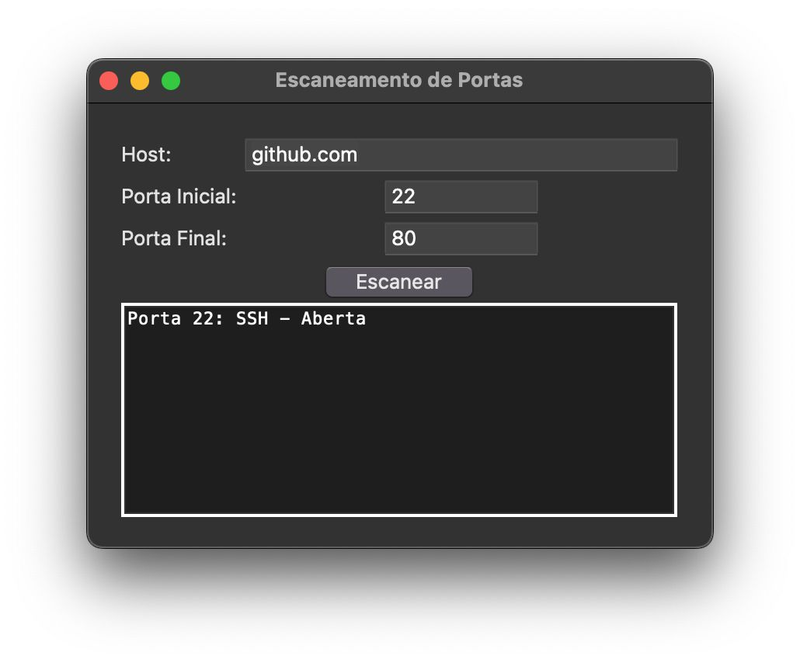
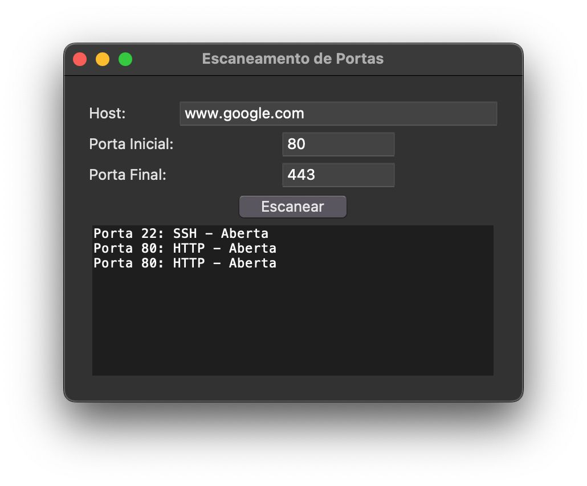

---

# Escaneamento de Portas com Python

Este projeto consiste em uma aplicação Python para escaneamento de portas de comunicação em um host ou rede específica. A aplicação oferece uma interface gráfica amigável e permite ao usuário especificar o host alvo, o intervalo de portas a serem escaneadas e fornece informações sobre os serviços associados às portas abertas.



## Funcionalidades

- Escaneamento de portas TCP em um host ou rede.
- Interface gráfica de fácil utilização.
- Especificação do intervalo de portas a serem escaneadas.
- Identificação dos serviços associados às portas abertas.

## Pré-requisitos

- Python 3 instalado.
- Biblioteca `tkinter` instalada (normalmente incluída na instalação padrão do Python).

## Como usar

1. Clone o repositório:

```bash
git clone https://github.com/seu-usuario/escaneamento-portas-python.git
```

2. Navegue até o diretório do projeto:

```bash
cd escaneamento-portas-python
```

3. Execute o arquivo `main.py`:

```bash
python main.py
```

4. Insira o host alvo, o intervalo de portas desejado e clique em "Escanear".

5. Aguarde o término do escaneamento. As portas abertas e os serviços associados serão exibidos na interface.



## Exemplos

Aqui estão alguns exemplos de hosts e intervalos de portas que você pode testar:

1. Host: `localhost` (127.0.0.1)
   - Intervalo de Portas: 1 a 1024 (portas conhecidas)

2. Host: `google.com` (172.217.164.78)
   - Intervalo de Portas: 80 a 443 (portas comuns para comunicação web)

3. Host: `example.com` (93.184.216.34)
   - Intervalo de Portas: 20 a 1024 (portas conhecidas)

4. Host: `github.com` (140.82.121.4)
   - Intervalo de Portas: 22 a 80 (portas comuns para SSH e HTTP)

---

Este projeto foi desenvolvido como parte de um exercício de aprendizado e pode ser usado como base para aplicações mais avançadas de escaneamento de portas. Sinta-se à vontade para contribuir e fazer melhorias!